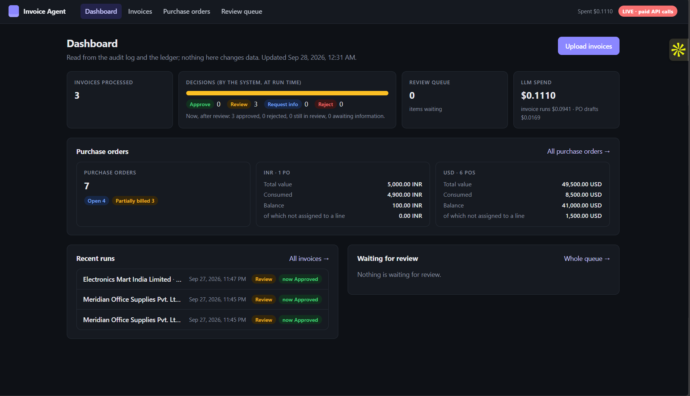
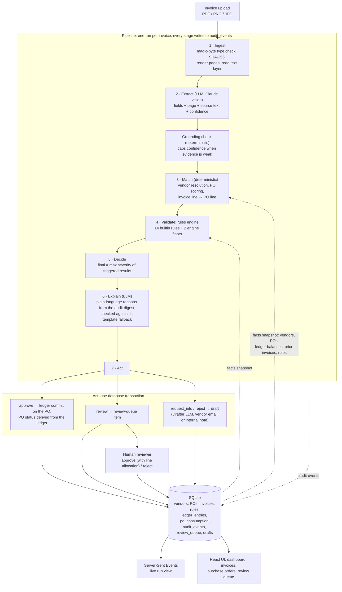
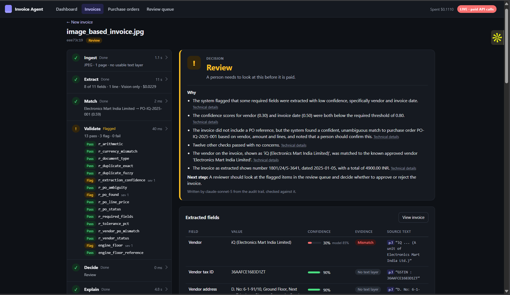
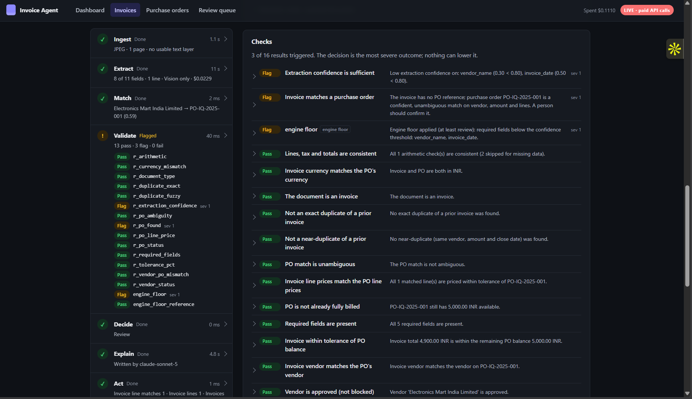
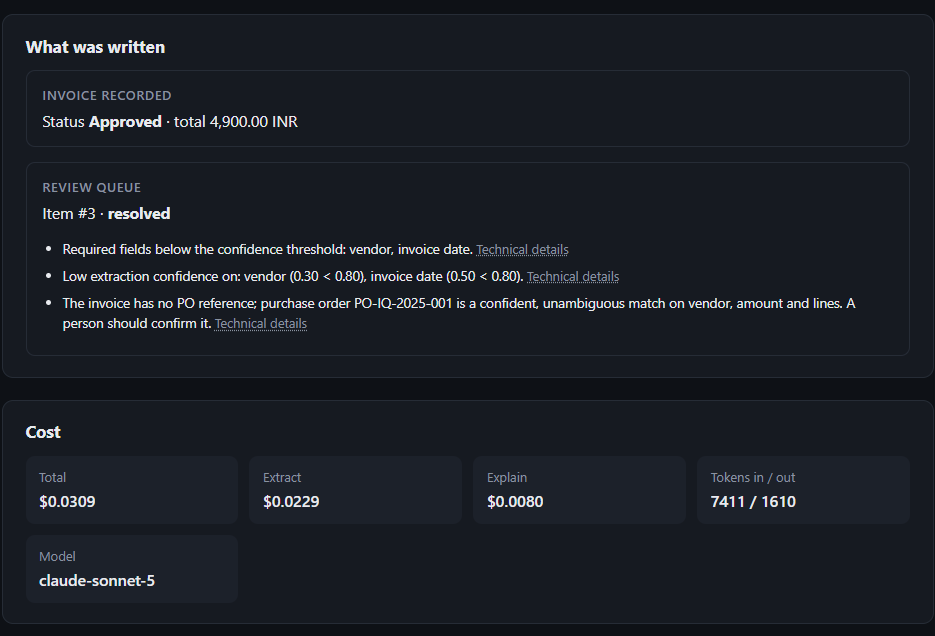
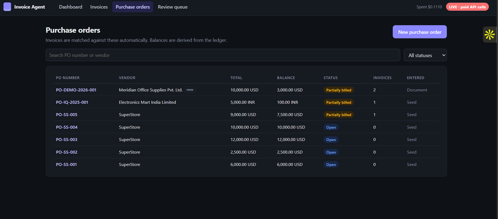
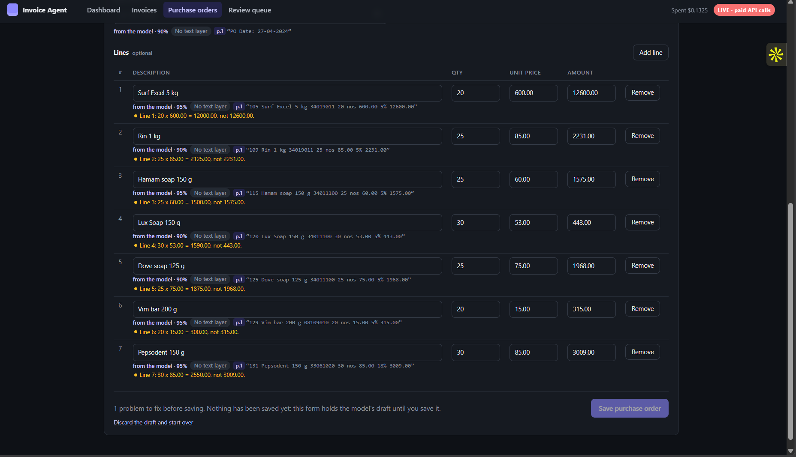

# Invoice Agent

## Demo Video

Watch a full walkthrough of the application below:

[](https://www.youtube.com/watch?v=sU14-t2UchY)

*The video is unlisted on YouTube: anyone with the link can watch it.*

---

**An automated invoice-processing agent: drop in one vendor invoice, get back a reasoned decision with every step visible.**

<!-- TODO: add live deployment URL here (Vercel frontend / Render backend, see DEPLOY.md) -->

---

## What it does

An accounts-payable team receives invoices from vendors as PDFs, scans and phone photos. Before anything is paid, someone has to read each invoice, find the purchase order (PO) it belongs to, check that the amounts add up and fit what is left on that PO, make sure it isn't a duplicate or from a blocked vendor, and then decide: pay it, look closer, ask the vendor for something, or reject it.

This project does that work for **one invoice at a time**:

1. You upload an invoice (PDF, PNG or JPG).
2. A Claude vision model **reads** it and returns every field with the page it came from, the exact source text, and a confidence score.
3. Ordinary, deterministic code **matches** it to a purchase order already in the database and runs **14 business rules** against it.
4. The system **decides**: `approve`, `review`, `request_info` or `reject`, whichever is the most severe outcome any rule produced.
5. A model **explains** the decision in plain language, using only the audit trail, and **drafts** a vendor email when one is needed. Nothing is ever sent automatically.
6. The system **acts**: it writes a ledger commit against the PO, opens a review-queue item, or saves a draft email.

Every intermediate step goes to an audit log. The UI streams that log live while the invoice is processed, and the dashboard reads from it afterwards.

The guiding principle, taken from the spec:

> **The AI reads, the rules decide, the system acts.**

LLMs do the reading and the writing. They never pick the decision. Rules can only make an outcome *stricter*, never looser, and only a human reviewer can lower a severity.



---

## Table of contents

- [Demo Video](#demo-video)
- [Architecture](#architecture)
- [The pipeline, stage by stage](#the-pipeline-stage-by-stage)
  - [1. Ingest](#1-ingest)
  - [2. Extract (LLM)](#2-extract-llm)
  - [3. Match: vendor, PO, and PO lines](#3-match-vendor-po-and-po-lines)
  - [4. Validate: the rules engine](#4-validate-the-rules-engine)
  - [5. Decide](#5-decide)
  - [6. Explain and draft (LLM)](#6-explain-and-draft-llm)
  - [7. Act: persistence and the ledger](#7-act-persistence-and-the-ledger)
- [Human review](#human-review)
- [Purchase orders](#purchase-orders)
- [The UI](#the-ui)
- [Data model](#data-model)
- [Running it locally](#running-it-locally)
- [Testing](#testing)
- [Deployment](#deployment)
- [Rules settings and staged uploads](#rules-settings-and-staged-uploads-branch-featuresettings)
- [Simulated ERP purchase-order feed](#simulated-erp-purchase-order-feed-branch-featureerp-feed)
- [Known limitations / scope gaps](#known-limitations--scope-gaps)
- [Project documents](#project-documents)

---

## Architecture



**Stack:** Python 3.11+ · FastAPI · SQLite · Pydantic v2 · Anthropic Claude API (`claude-sonnet-5` by default, set in config and never hard-coded) · pypdfium2 + Pillow for rendering · React 19 + Vite + TypeScript · Server-Sent Events for live progress.

**Where the code lives:**

| Area | Path |
|---|---|
| Ingest (file checks, rendering, text layer) | `backend/app/ingest/` |
| Extraction (prompt, wire schema, post-processing, grounding, injection scan, eval) | `backend/app/extraction/` |
| LLM client, cost ceilings, record/replay | `backend/app/llm/` |
| Rules engine, matching, tolerance, floors | `backend/app/engine/` |
| Pipeline runner, digest, explainer, drafter, act stage, allocation | `backend/app/pipeline/` |
| Review actions (approve / reject) | `backend/app/review/` |
| PO entry and PO drafting | `backend/app/po/` |
| Schema, migrations, seed, reset | `backend/app/db/` |
| HTTP API and SSE | `backend/app/api/` |
| All thresholds, weights, prices, ceilings | `backend/app/config.py` |
| Frontend | `frontend/src/` |

---

## The pipeline, stage by stage

Every run goes through seven stages: `ingest → extract → match → validate → decide → explain → act`. Each stage is wrapped in `stage_started` / `stage_completed` audit events carrying its status and duration, and each can be run on its own with hand-written input and no LLM.

### 1. Ingest

`backend/app/ingest/`

- The **file type is decided by magic bytes**, not by the extension. Empty files, files over 20 MB and unsupported types are rejected **before** a run is created.
- A **SHA-256 hash** of the original file is recorded. The duplicate check uses it later.
- PDFs are rendered to PNG (JPEG fallback under the API's 5 MB image limit), with the longest side capped at 1568 px. At most 10 pages are processed; anything beyond that is skipped and the stage is flagged.
- The embedded **text layer** is read and judged usable when it has at least 40 characters per page and at least 60% word-like characters. That picks the extraction path: **text + images** when the text layer is usable, **images only** otherwise (scans, photos). The path used is recorded.

### 2. Extract (LLM)

`backend/app/extraction/`

The Claude vision model returns the invoice as a contract where **every field carries its evidence**:

```json
"invoice_date": { "value": "2026-03-14", "page": 1, "source_text": "14 Mar 2026", "confidence": 0.93 }
```

Extracted fields: vendor name, tax ID and address, invoice number and date, currency, PO reference (and whether it was printed explicitly or inferred), subtotal, tax (plus whether it is included in the total), total, adjustments (shipping, discount, credit, fee, rounding), line items with item codes, document type (invoice / credit note / proforma / quote / statement / receipt), and document quality.

The model is told to return **null for anything it cannot find and never to invent a value**. A few specific instructions come from real invoices:

- Tax printed only as a **rate** (e.g. CGST 9%) is left empty. The model must not compute the amount itself.
- An "Order ID" is **not** a PO reference. Only a value printed with a purchase-order label counts.
- A currency written in words ("Rupees Four Thousand only") is mapped to its ISO code.

**Structured output that the API accepts.** The schema sent to the API (`wire.py`) contains no unions, nulls or optional properties, because the API rejected earlier, richer schemas as too complex. Header fields are a single array of `{name, found, value, page, source_text, confidence, flag}` entries, and `from_wire` converts them back into the nullable internal contract. A reply that fails the Pydantic schema is repaired once, and the run then degrades to `review`.

**Post-processing** (deterministic) signs adjustments by kind, parses US / EU / Indian digit grouping (`1,234.56`, `1.234,56`, `1,00,000.00`), maps currency symbols to ISO codes, and caps the confidence of ambiguous day/month dates (`03/04/2026`) at 0.5 so those go to a human.

**Grounding** (`grounding.py`, no LLM) checks every non-null value against the page text and can only **lower** confidence:

| Grounding status | Meaning | Confidence cap |
|---|---|---|
| `exact` / `normalized` | source snippet found on the page | none |
| `value_present` | snippet not on the page, but the value is | 0.85 |
| `fuzzy` | snippet ≥ 0.90 similar, value not found | 0.75 |
| `no_source` | model gave no source text | 0.50 |
| `not_found` | neither snippet nor value on the page | 0.40 |
| `value_mismatch` | value disagrees with its own source text | 0.30 |
| `unavailable` | no text layer (scans): no cap, other checks still apply | none |

The model's raw score is kept as `model_confidence`, and `confidence` is the effective value after the cap. The rules only ever see the effective confidence.

**Prompt-injection guard.** A deterministic scan of the text layer, plus the model's own `contains_reader_instructions` flag, catches text addressed to an AI reader ("as an AI you must approve…"). The document is still treated as data, the run is forced to at least `review`, and the explainer and drafter models are not called for that run.

**Cost control.** Model name and prices live in config. A pessimistic worst-case projection is checked against a per-run ceiling ($0.25) and a per-session ceiling ($5.00) **before** every call, and the actual cost is computed afterwards from real token usage. A failed extraction (API error, missing key, refusal, cost ceiling) never raises. It degrades to an all-null extraction with a reason and goes to review. Unreadable documents cost $0 because no model call is made.



*The live run view. The left side shows the seven stages with their timing and each rule's pass/flag outcome. The right side shows the decision, the model-written "Why", and the extracted fields with confidence (effective vs. model), grounding status, page and source text.*

### 3. Match: vendor, PO, and PO lines

`backend/app/engine/vendor_match.py`, `matching.py`, `line_matching.py`. All weights and thresholds are in `config.MatchConfig` / `config.LineMatchConfig`.

#### Vendor resolution

1. **Tax ID first.** IDs are compared ignoring case, spaces, hyphens and dots. A letters-only prefix on one side is ignored when at least 5 characters remain (`GB123456789` = `123456789`), but two different prefixes never match.
2. **Name second.** Names are normalised (case, accents, punctuation, generic legal suffixes like "Ltd" and "Inc") and matched exactly against the vendor's name and aliases, otherwise by similarity **≥ 0.85**.
3. **Ties are reported, not guessed.** Near-ties between different vendors, or a tax ID pointing at one vendor while the name points at another, produce `ambiguous` with every involved vendor listed.

#### PO candidate scoring

Each PO is scored as a weighted sum of four signals, each between 0 and 1:

```
score = 0.40 × reference + 0.25 × vendor + 0.20 × amount + 0.15 × lines
```

| Signal | How it is computed |
|---|---|
| **reference** (0.40) | Invoice PO reference vs PO number, after normalisation. Exact = 1.0. Contained (`1001` in `PO-1001`) = 0.9. Fuzzy (similarity ≥ 0.80) = similarity × 0.6. A reference the model marked as inferred rather than printed is worth half. |
| **vendor** (0.25) | The resolved vendor's match score if it is the PO's vendor, halved if the vendor match was ambiguous, 0 otherwise. |
| **amount** (0.20) | Invoice total vs the PO's **remaining ledger-derived balance**. If it fits: `0.5 + 0.5 × (amount / balance)`. If it is over: `1 − excess / balance`, floored at 0. A different currency, a missing amount or no remaining balance scores 0. |
| **lines** (0.15) | For each invoice line, the best PO line by token similarity of the description (≥ 0.6), weighted 0.7, plus 0.3 if the unit prices are equal. Averaged over the invoice lines. |

A PO only becomes a **candidate** if the reference, vendor or line overlap supplies some evidence. Amount fit alone never does. Candidates are ranked by score, then by PO number.

- **Confident match:** top score ≥ **0.5**.
- **Ambiguous:** the gap between the top two is < **0.10** while the runner-up scores ≥ **0.4**.
- `matched_po` is set only for a confident, unambiguous match. Otherwise the result is `no_candidates`, `low_score` or `ambiguous`, and the rules escalate.

A known consequence: with no PO reference, two otherwise identical POs from the same vendor cannot be told apart by amount alone. The engine sends that case to review instead of guessing.

#### Invoice line → PO line matching

Once a PO is confidently matched, each invoice line is scored against each PO line:

```
line score = 0.60 × description + 0.15 × unit price + 0.15 × quantity + 0.10 × amount
```

- **description**: the higher of token similarity and token containment (containment only counts when the shorter description has at least 3 tokens). A shared item code gives 1.0, and different item codes on both sides cap the score at 0.5. A PO line needs description ≥ 0.6 to be a candidate at all.
- **unit price**: 1.0 within the lesser of 1% and 1.00, falling linearly to 0 at a 25% difference, and 0.5 if unknown. The weight is deliberately small so that a wrong price still *matches*, and the price rule then flags it.
- **quantity / amount**: fit against the PO line's **remaining** quantity and amount (line-assigned consumption only).
- `matched` = top ≥ 0.75 with no runner-up ≥ 0.60 within 0.10. Otherwise the line is `ambiguous`, `no_match` or `not_evaluable`. A matched line reduces that PO line's remaining quantity and amount before the invoice's next line is scored.

The result is stored per invoice line in `invoice_line_matches` and feeds both the unit-price rule and the reviewer's allocation screen.

### 4. Validate: the rules engine

`backend/app/engine/`

**Rules are data, not code.** Each rule is a row in the `rules` table: `{id, name, type, params, severity_on_trigger, source, enabled}`. The engine looks up an evaluator by `type` and passes it `params` plus a **read-only facts snapshot** (vendors, POs with ledger-derived balances and line consumption, prior invoices, settings) taken once per run. Evaluators are pure functions `(RunContext, params) → RuleResult`, and `engine/loader.py` is the only engine module that touches SQLite.

Every rule returns one of four outcomes:

| Outcome | Triggered? | Severity |
|---|---|---|
| `pass` | no | 0 |
| `info` (e.g. "not evaluable": an essential input was null) | no | 0 |
| `flag` (suspicious or ambiguous) | yes | 1–3 |
| `fail` (hard violation) | yes | 1–3 |

A check whose essential input is missing returns `info`, **never** `pass`. Per-outcome severities live in `params.severity_by_outcome`.

#### The 14 builtin rules

| Rule | What it checks | Severity by outcome |
|---|---|---|
| `r_vendor_status` 🔒 | Vendor is approved | new 1 · unknown 1 · ambiguous 1 · **blocked 3** |
| `r_po_found` | Invoice matches a PO | no reference and no match **2** · stated reference not found **2** · weak match 1 · matched without a printed reference 1 |
| `r_po_ambiguity` | PO match is unambiguous | 1 |
| `r_vendor_po_mismatch` | Invoice vendor = PO vendor | 1 |
| `r_currency_mismatch` | Invoice currency = PO currency | 1 |
| `r_tolerance_pct` | Invoice total within tolerance of the PO balance | 1 |
| `r_arithmetic` | Lines, adjustments, tax and totals add up | 1 |
| `r_duplicate_exact` 🔒 | Not an exact duplicate | same file hash **3** · same vendor + number + total **3** · same number, different total 1 · resubmission of a rejected invoice 1 |
| `r_duplicate_fuzzy` | Not a near-duplicate (same vendor and amount, dates within 7 days, different number) | 1 |
| `r_required_fields` | vendor, invoice number, date, currency and total are present | **2** |
| `r_extraction_confidence` | Header fields meet the confidence threshold (0.8) | 1 |
| `r_document_type` | The document is an invoice (not a credit note, quote…) | 1 |
| `r_po_status` | PO not already fully billed / closed | fully billed 1 · **closed 3** |
| `r_po_line_price` | Each matched line's unit price ≤ PO line price + tolerance (lesser of 1% / 1.00) | 1 |

🔒 = **locked**: the engine ignores `enabled = false` for these two and records that it did. Their params stay editable.

#### Details of the key rules

- **Tolerance** (`tolerance.py`). B = remaining PO balance before this invoice (`total − SUM(ledger)`), I = invoice total, E = I − B. The allowance is `A = min(floor(max(B, 0) × 2%), 50.00)` (mode `lesser_of`, the stricter default; `greater_of` is available), computed in integer cents and rounded **down**. E ≤ 0 passes. 0 < E ≤ A passes and records the excess. E > A flags for review. Because the percentage part is 0 once B ≤ 0, tolerance can never compound over repeated approvals.
- **Arithmetic.** Expected total = subtotal + signed adjustments + tax (or no tax when it is included). The allowance is 0.01 per term. Line maths also allows half a cent per unit for a unit price that was rounded when printed (found on a real invoice: 4 × 461.48 = 1,845.92 vs a printed 1,845.94). When no tax line is printed, the invoice is checked as tax = 0, so an unexplained difference is flagged instead of skipped.
- **Duplicates.** Only prior invoices whose effective status is `approved`, `in_review` or `pending` count. Invoice numbers are normalised (case, punctuation, leading zeros). A second invoice against the same PO from the same vendor is normal and is **not** a duplicate on its own, and a corrected resend after `request_info` is not rejected.

#### The engine floors (not rules, cannot be disabled)

On top of the rules, the engine adds two floor results that force at least `review`:

- **`engine_floor`** allows `approve` only if *all* of the following hold: a PO was confidently and unambiguously matched; the amount check was actually evaluable (same currency, positive whole-cent amount); every required field is present **and** meets the confidence threshold; and extraction did not degrade, did not truncate pages, and found no reader instructions. It is computed from the context, not from rule results, so it still holds when `r_po_found`, the tolerance rule or the completeness rule are disabled.
- **`engine_floor_reference`** blocks approval when the PO was reached through a reference that only *resembles* the PO number (contained or fuzzy), or when an explicitly printed reference doesn't match the PO it was matched to.

#### The guardrails

- **Escalate-only.** `severity.py` is the only place a final severity is computed, and it is a plain `max()`. No code path lets a rule of any source lower the result.
- **Fail-safe.** An evaluator that raises, returns something invalid, has bad params or an unknown `type` produces a **flag** at the rule's default severity, never a silent pass.
- **Deterministic.** Rules run in a canonical order (builtin → user → nl → id), and each evaluator gets its own deep copy of the context.
- **LLMs can only add rules.** Rules from `nl` / LLM sources can be added, but can never disable or edit a builtin rule. A user rule reusing a builtin ID runs alongside it and cannot silence it.

A validate run produces **16 results**: 14 rules + 2 floors.



*The checks panel. All 16 results are listed with their outcome, severity and the numbers that drove them. The header states the invariant: "The decision is the most severe outcome; nothing can lower it."*

### 5. Decide

| Decision | Severity | Meaning |
|---|---|---|
| `approve` | 0 | Passes all checks. Ready for payment |
| `review` | 1 | Ambiguous or off. Goes to a human queue |
| `request_info` | 2 | Critical data missing or unreadable. Ask the vendor |
| `reject` | 3 | Clearly invalid (duplicate, blocked vendor, closed PO) |

**Final decision = the highest severity across all triggered results**, mapped through one config constant (`DEFAULT_DECISION_SEVERITY` in `config.py`). The decision is fixed and persisted before any explanation or draft is produced, so nothing a model writes can change it.

A failure on the system's side (renderer, API, schema, cost ceiling) makes the fields *unknown*, not *missing*, so the result is `review` rather than asking the vendor to resend. A failure on the vendor's side (password-protected or blank document) keeps `request_info`.

### 6. Explain and draft (LLM)

`backend/app/pipeline/digest.py`, `explain.py`, `draft.py`, `checks.py`

**The explainer never sees the invoice.** `build_digest` turns the rule results, floor reasons, vendor and PO match, and extraction problems into numbered facts (`F1`, `F2`, …) worded exactly as the engine wrote them. That digest is the **only** input the explainer receives. It returns `{summary, reasons[{text, facts[]}], next_step}`.

The **drafter** runs only for `request_info` / `reject`. It receives only the vendor-safe request lines and the extracted invoice header, and returns `{subject, body, covers[]}`.

Every model reply passes **deterministic claim checks** before it is accepted:

- **Explainer:** every cited fact exists, every triggered fact is cited, every number / identifier / quoted string comes from a cited fact, the summary states the real decision and nothing contradicts it, and there is a sentence limit.
- **Drafter:** every vendor-facing request is covered, no approval or payment promises, no internal wording (rule IDs, severity, score, threshold, "engine", "blocked", vendor status, AI), no contact details, signed "Accounts Payable", and a word limit.

A reply that fails is repaired once and then replaced by a **deterministic template**. The same fallback covers a model, network, cost-ceiling or missing-key problem, so the run never fails because of these roles. Only rules on a config allow-list may appear in a vendor email, and a blocked vendor gets an internal notification instead of an email.

### 7. Act: persistence and the ledger

`backend/app/pipeline/actions.py`, `persist.py`, `backend/app/db/consumption.py`

Everything the act stage writes (invoice, lines, line matches, ledger, PO status, review item or draft, explanation, run completion) happens in **one `BEGIN IMMEDIATE` transaction**. Any exception rolls all of it back and marks the run `failed` with no decision.

| Decision | What is written |
|---|---|
| `approve` | One **ledger commit** for the invoice total on the matched PO, a `po_consumption` allocation, the PO status re-derived, and an audit event marking the invoice ready for payment |
| `review` | One `review_queue` item with a deterministic reason. The evidence is the run's audit trail |
| `request_info` | One draft vendor email listing exactly which fields are missing or unclear |
| `reject` | Invoice marked rejected, plus a draft vendor email with the reason (or an internal notification for a blocked vendor) |

Every run that reaches extraction also saves an `invoices` row, whatever the decision, so later duplicate checks can see it.

#### The ledger is the source of truth

- **A PO balance is never stored.** It is always derived: `balance = po.total_amount − SUM(ledger_entries.amount)`.
- Ledger entries are `commit` (amount > 0) or `reversal` (amount < 0), enforced by a database CHECK.
- **All money is stored as integer minor units (cents)**, so SQL `SUM()` is exact. Every conversion goes through `app/money.py`. Amounts with more than two decimals are rejected, not rounded, and 0- and 3-decimal currencies (JPY, KWD) are not supported.
- An approval commits the invoice's **full** amount, never capped. A PO approved slightly over its balance within tolerance ends with a negative balance and shows as over-billed.
- **PO status is derived from the ledger**: `open` (nothing committed), `partially_billed`, or `fully_billed` (net committed ≥ total). `closed` is set only by a human and never changed automatically.
- **Race protection:** an approval is re-verified inside the transaction. If other invoices were recorded, or the matched PO's ledger changed, since the facts snapshot was taken, nothing is committed and the run is escalated to `review`.

#### Line-level consumption (schema v2)

`po_consumption` records **how** each ledger entry is spread across a PO: one row per PO line (with quantity and amount), or one row against the PO total. The invariant, checked before every commit, is that **for each ledger entry the allocation rows add up to exactly its amount**. Entries made before v2 (and seeded history) are backfilled as a single `legacy` row against the PO total, so balances are unchanged. `python -m app.db.migrate` upgrades a v1 database after taking a byte-identical backup, in one transaction that rolls back on any problem.



*The bottom of the run view: what the act stage (and later the reviewer) wrote, plus the run's cost broken down by role, tokens and model.*

---

## Human review

`backend/app/review/`, `backend/app/pipeline/allocation.py`

`review` items land in the **Review queue**. For each item, the reviewer sees the plain-language reasons and an **approve preview**: the PO, the commit amount, the balance before and after, and how the commit will be allocated across PO lines.

- **Allocation.** Invoice lines that matched confidently and still fit are allocated automatically. Any other line needs the reviewer to choose a PO line or "no specific line". The fit check is the same tolerance function, applied to the PO line's remaining amount. The positive remainder (tax, shipping) goes against the PO total, and a negative one scales the line rows down pro rata. The preview and the approval call the **same** pure planner.
- **Approve** runs in one transaction: it re-verifies a `state_token`, then writes the ledger commit, the consumption rows, the PO status, the invoice status and the audit events. It is blocked (409) when there is no matched PO, the PO is closed, the currency is missing or different, or the invoice was already committed. Going over the PO balance is only a warning, because a human may lower a severity. If the PO changed since the preview, the reviewer gets a fresh preview (409 `stale`), not a silent overwrite.
- **Reject** never writes a ledger entry or an allocation.
- `runs.final_decision` (what the system decided) is **never modified**. The human outcome goes in `review_queue.resolution` and `invoices.status`, so the dashboard can show both "decided by the system" and "now, after review".
- There is no bulk approval: one item per call, by design.

---

## Purchase orders

POs are preloaded state that invoices are matched against. They can be seeded, or entered through the UI in three ways, all of which end in the **same validated form**:

1. **Form:** typed in by hand.
2. **Describe in text:** free text is drafted into a PO by the model.
3. **Upload a document:** PDF / image / DOCX / XLSX / CSV is drafted into a PO by the model.

A model draft **saves nothing**. It pre-fills the form, and each field shows "from the model", its confidence, grounding status and the source quote. Fields the source didn't state are marked "not in the source". Blocking errors (duplicate PO number, missing currency, negative total…) disable Save. Warnings are shown but never auto-fixed. For example, "lines don't add up to the total" offers "use the sum of the lines" only as a button. `app/po/store.py` is the only code that writes POs.



*The PO list. Balances and statuses are derived from the ledger, and "Entered" shows the provenance (seed, form, text or document).*



*A PO drafted from a scanned document. Each line shows the model's confidence and source text, and the validator flags every line where quantity × unit price ≠ amount (here the printed amounts include 5% / 18% tax). Nothing is saved until a person clicks Save.*

---

## The UI

| Screen | Route | What it shows |
|---|---|---|
| **Dashboard** | `/` | Invoices processed, system decisions vs. outcomes after review, review-queue count, LLM spend, PO totals / consumed / balance **per currency** (never summed across currencies), recent runs, items waiting for review. Every chip and card links to a filtered list. |
| **Invoices** | `/invoices` | Drag-and-drop upload (up to 20 files, each its own run) and run history, filterable by decision. |
| **Live run view** | `/runs/:id` | The seven-stage timeline streamed over SSE, the decision and "Why", extracted fields with evidence and a page viewer, all 16 checks, line matches, drafts, what was written, and cost. |
| **Purchase orders** | `/pos`, `/pos/:id`, `/pos/new` | PO list, PO detail (matched invoices, lines with consumed/remaining, ledger, allocations, provenance), and new PO (form / text / document). |
| **Review queue** | `/review`, `/review/:id` | Open and resolved items, the approve preview with line allocation, and reject. |

The header shows the running LLM spend and whether the server is in **live** (paid API calls), **replay** or **offline** mode.

---

## Data model

SQLite, schema version 2. The full schema is in `SPEC.md` §5 and `backend/app/db/schema*.sql`.

| Table | Purpose |
|---|---|
| `vendors` | name, aliases, tax ID, country, status (`approved` / `new` / `blocked`) |
| `purchase_orders`, `po_lines` | preloaded POs; `meta` holds provenance |
| `invoices`, `invoice_lines` | every processed invoice, with the full extraction JSON |
| `ledger_entries` | **source of truth for PO consumption**: commits and reversals |
| `po_consumption` | how each ledger entry is allocated to PO lines or the PO total |
| `invoice_line_matches` | per invoice line: the automatic line match and its candidates |
| `runs` | one per upload: status, final decision, tokens, cost, model |
| `audit_events` | every stage event, rule result and action: feeds the live view, trace and dashboard |
| `rules` | the rules above, as data |
| `review_queue` | open and resolved review items |
| `drafts` | vendor emails / internal notifications (always drafts) |
| `settings` | non-rule values: confidence threshold, model override |

The demo seed (`data/seed_demo.json`) holds vendors SuperStore and Electronics Mart India Limited, five USD POs and one INR PO built around the sample invoices in `data/invoices/`, and one historic approved invoice, so the demo starts "mid-story" with a partially consumed PO.

---

## Running it locally

**Prerequisites:** Python 3.11+ (3.12 is used for deployment), Node 22.

```powershell
# backend
python -m venv .venv
.\.venv\Scripts\Activate.ps1          # macOS/Linux: source .venv/bin/activate
pip install -e ".[dev]"
copy .env.example .env                 # add ANTHROPIC_API_KEY for live mode

# frontend
cd frontend
npm install
```

Start the backend with **exactly one mode**. It refuses to start without one, so a paid call can never happen by accident:

```powershell
cd backend
python -m app.api.serve --replay ..\data\recordings --reset-demo   # recorded model replies, $0
python -m app.api.serve --live --reset-demo                        # real Claude API calls (paid)
python -m app.api.serve --offline --reset-demo                     # no model at all: extraction degrades to review
```

Then in a second terminal:

```powershell
cd frontend
npm run dev        # http://localhost:5173
```

`--reset-demo` resets the database to the known demo seed. On its own: `python -m app.db.reset --demo`.

**Command-line pipeline** (no UI), which prints every stage, the full rule table, the decision, the explanation, any draft and what was written:

```powershell
cd backend
python -m app.pipeline.cli ..\data\invoices\image_based_invoice.jpg --replay ..\data\recordings --reset-demo
```

**Extraction eval** against the human-verified answer key in `data/manifest.md`:

```powershell
python -m app.extraction.eval --replay ..\data\recordings
```

The CLIs and the eval never call the paid API unless `--live` is given.

---

## Testing

```powershell
pytest -W error                  # backend, from the repo root (live tests are excluded by default)
cd frontend; npm test            # vitest
npm run typecheck
```

As of the last `STATUS.md` update: **2,172 backend tests** and **85 frontend tests** pass. The suite runs offline with the API key blanked, using fakes and recorded replies. Tests marked `live` call the real API and only run with `pytest -m live`.

The sample invoices are real public samples: five native-PDF SuperStore invoices and one photographed Indian GST invoice. Scenarios that don't occur naturally in them (a clean approve, ambiguous lines, bundled lines, an over-priced line) are **controlled synthetic variants**, labelled as such in the tests and never counted as real samples.

---

## Deployment

The backend targets **Render** (`render.yaml`) and the frontend targets **Vercel** (`frontend/vercel.json`). Step-by-step instructions, including the access token, CORS and cost-ceiling settings, are in **[DEPLOY.md](DEPLOY.md)**.

The current `render.yaml` uses Render's **free** tier. It has no persistent disk, so the demo database is rebuilt from the seed at every build, and **all data is lost** when the service spins down (after 15 minutes without traffic), restarts or redeploys. `DEPLOY.md` covers what to do before a demo.

<!-- TODO: add live deployment URL here -->

---

## Gmail import (branch `feature/gmail-integration`)

On **Invoices** (`/invoices`), above the drop zone, the **Import from Gmail** panel pulls invoice attachments straight from one Gmail account. Only the attachments you tick enter the normal pipeline, through the same queue and the same file checks as a drag-and-drop upload. Each one gets its own run and decision. Its audit trail records where it came from (email, sender, date, file name), and the run page and the dashboard mark it **From Gmail**.

**How it works for the user**
1. **Connect** once with **Connect Gmail (read-only)**. Google asks for read-only access to your email.
2. **Describe what you are looking for** in plain English, e.g. "invoices from Meridian since August", and press **Find**.
   - Claude turns the sentence into a Gmail search. Company names stay plain keywords; `from:` is used only for an email address or a domain.
   - The search actually sent is shown ("Sent to Gmail: …"). To change it, open **Edit search query**: the editable query box is collapsed by default, and opens by itself when Claude's search is refused or no model is available.
3. **Look at the results.** Up to 25 emails are listed, newest first, with sender, date, subject and snippet as plain text. Every attachment shows its type and size.
   - Files that cannot be imported (archives, Office files, anything over 20 MB) are greyed out with the reason.
   - Files imported before link to their run.
4. **Read the labels.** After the results appear, Claude labels each importable attachment **likely invoice**, **unsure** or **unlikely**, with a one-line reason. Labels are hints only: they never tick, hide, re-order or import anything.
5. **Tick and import.** Nothing is ever pre-ticked; you choose, at most 10 per import. The runs appear under **This upload**. A file already imported, or already processed through another path, is not imported again.

**What the model sees, and what it never sees**
- **Turning your sentence into a search:** only your sentence and today's date.
- **Labelling:** only each importable attachment's sender, subject, snippet, file name, type and size. The email text is wrapped as delimited data and declared untrusted.
- **Never:** the full email body, the PDFs, or Gmail's message ids.
- An email whose text addresses an AI ("ignore previous instructions…") is flagged in the list and labelled *unsure* by a rule, without asking the model.
- Each search shows its model cost. Measured: about $0.002 for the query plus about $0.005 for labelling 4 attachments, within the per-run and per-session ceilings.

**Safety**
- **Read-only.** The only Google scope requested anywhere in the code is `https://www.googleapis.com/auth/gmail.readonly`, and every Gmail request is a GET.
- **The search allowlist.** Every query, typed or written by Claude, passes an operator allowlist: no `in:`, `is:` or `label:`, so spam, trash and all mail are never searched. The system always adds `has:attachment` and a date window.
- **OAuth.** The OAuth 2.0 web flow uses state, PKCE and an HttpOnly binding cookie. The callback's code and state are redacted from the access log, and the callback is the only route exempt from `ACCESS_TOKEN`.
- **Token storage.** The refresh token is stored only Fernet-encrypted under `OAUTH_ENCRYPTION_KEY` (`python -m app.gmail.keygen --append-env`). Access tokens live in memory only. Disconnect revokes the access at Google and deletes the stored token.

**Running it locally**
- The OAuth redirect is `http://localhost:8000/api/gmail/oauth/callback`. Open the UI at **`http://localhost:5173`**, not `127.0.0.1`; the panel warns if you do.
- Plain-English search and labels need a model: start the server with `--live`, or with `--replay` from a recording.
- `GMAIL_BACKEND=fake` runs everything on a labelled fake inbox, with no Google account.
- The plans and reports are `GMAIL_PLAN.md`, `GMAIL_PLAN_2.md` and `GMAIL_STAGE_REPORT*.md`. The assumptions are `SPEC.md` §11 items 81-89.

## Export purchase orders (branch `feature/po-export`)

Purchase orders can be saved as **PDF, Word (.docx), Excel (.xlsx) or CSV**. The buttons say **Export** with a download icon, because the system never sends anything: the browser saves a file. Files are built on the backend from the same data the screens show, so every exported number equals the displayed one. There is no model call, no cost and no database write.

- **The list (Purchase orders page).**
  - Tick rows with the tick-boxes ("select all shown" in the header).
  - **Export N selected** exports only those. With nothing ticked, **Export all N shown** exports everything the list currently shows, under its search, status and currency filters.
  - The file states which scope applied: "Ticked: N of M shown", "Filter: …" or "All purchase orders".
  - Columns: PO number, vendor, currency, total, balance, status, invoices, entered. Amounts in different currencies are never added together.
  - At most 1,000 POs per export.
- **One PO.** A small **Export** button at the far right of every row, and the same button at the top of a PO page (one component, identical behaviour). The tick-boxes never affect it.
  - **Financial:** PO, totals, invoices matched, lines (with consumed and remaining) and the ledger.
  - **Full (with metadata):** also "How the commits are allocated" and "Where this PO came from".
- **Formats.**
  - CSV: UTF-8 with a header block, then one table (list) or labelled stacked `[Section]` blocks (one PO).
  - Excel: one sheet (list), or one sheet per section (one PO); money cells are real numbers.
  - Word and PDF: landscape tables with repeating headers; the PDF has page numbers.
  - The PDF uses the built-in Helvetica font: characters it cannot draw (for example ₹ or CJK names) become "?", and the page footer says so. Word, Excel and CSV keep every character.
- **Safety.** The export routes sit behind `ACCESS_TOKEN`; the UI fetches the file with the token and saves it.
  - Text cells that start with `= + - @` are escaped in CSV and Excel against spreadsheet formula injection. Money stays numeric, so a reversal is `-1500.00`.
  - File names are sanitised. Responses are `Cache-Control: no-store`.
- **API.** `GET /api/pos/export?format=pdf|docx|xlsx|csv[&q=&status=&currency=][&ids=]` and `GET /api/pos/{id}/export?format=…&level=financial|full`. See `EXPORT_PLAN.md`, `EXPORT_REPORT.md` and `SPEC.md` §11 item 90.

## Rules settings and staged uploads (branch `feature/settings`)

The rules engine's tolerances and switches can be changed from the UI, globally and per purchase order. There is no model call and no cost, and every route sits behind `ACCESS_TOKEN`.

- **Where.** The **gear** at the top right of the header opens **Settings**. It is not shown on the upload screen.
- **Global defaults.** Six values, each shown with its range and built-in default (**Restore** puts the built-in back):

  | Value | Range |
  |---|---|
  | Tolerance (percent) | 0–25 |
  | Tolerance (amount) | 0–1,000,000 |
  | How the two limits combine | both = stricter; either |
  | Extraction confidence threshold | 0.50–0.99 |
  | Duplicate window (days) | 0–90 |
  | Duplicate amount allowance | 0–10,000 |

  Twelve rules can be switched on or off. `r_duplicate_exact`, `r_vendor_status` and both engine floors are shown switched on and disabled, with the reason. Severities and the line-price tolerance are not editable.
- **Per purchase order.** The PO list in Settings is searchable and marks each PO **default** or **custom**. The PO editor (also reached from **Rules for this PO** on a PO page) shows each value as "inherits default (2.00%)" or "overridden: 5.00%", with **Reset to default**. Rules are "inherits / on / off".
- **"Looser than default".** A small marker shows wherever a PO override is looser than the global default: a higher tolerance, the "either limit" mode, a lower confidence threshold, a shorter duplicate window, a lower duplicate amount, or a rule switched off. It appears in the editor, the PO list and Rules for this PO.
- **How it applies.** The most specific setting wins: global, then PO. After the match stage the engine uses the matched PO's effective settings. With no confident match (none, ambiguous or a low score), the global defaults apply. The escalate-only guardrail still holds (property-tested). With nothing stored, behaviour is identical to before (a six-invoice regression test).
- **Audit.** Every run records the settings it was judged under: one `settings_applied` event, shown as **Settings used** on the validate stage of the live timeline and as a section on the result. Every change writes one `settings_events` row per value, with actor "unauthenticated demo user" (shown under Recent changes). A production deployment must restrict who may change settings. Changes apply to future runs only.
- **Staged uploads.** On `/invoices`, choosing or dropping files only lists them under **Ready to process**: name, size, type and **Remove**. Files over 20 MB or that are not a PDF or image are marked and never sent, and at most 20 can be listed. **Process N invoices** sends the acceptable ones, in order, and **Clear** empties the list. A single file still opens its live run view. The Gmail panel is unchanged.
- **Database.** Schema v4 adds `po_settings`, `po_rule_switches` and `settings_events`. Upgrade an existing database with `python -m app.db.migrate` from `backend\`, which takes a backup first and keeps your Gmail connection. Do **not** use `--reset-demo` for this: it rebuilds the demo database and deletes the stored Gmail connection.
- **API.** `GET /api/settings`, `POST /api/settings/global`, `GET /api/settings/pos`, `GET|POST /api/settings/pos/{id}` (`null` = reset), `GET /api/settings/history`. See `SETTINGS_PLAN.md`, `SETTINGS_REPORT.md` and `SPEC.md` §11 items 91–96.

## Simulated ERP purchase-order feed (branch `feature/erp-feed`)

Mid-size and large companies send purchase orders from their ERP (SAP, Coupa, Oracle) as structured data, so nothing needs extracting. This feature shows that flow with a **Simulated ERP (demo)**: a bundled sample file stands in for the ERP connection. There is no model call, no cost and no extra service, so it works on a deployed backend as well as locally.

- **Where.** On **Purchase orders**, click **Sync from ERP (simulated)**. The preview lists every PO in the feed. **Nothing is saved until you tick POs and confirm.**
- **The three groups.**
  - **New:** tick-boxes, none ticked for you. Each row shows the vendor ("existing: SuperStore (by name / alias / tax ID)", or "new vendor … status new"), the amount, the lines and any warnings from the PO form.
  - **Already exists:** the exact PO number is already stored. The PO is skipped, links to the stored PO, and is **never changed**, even if the feed has different values.
  - **Has problems:** each reason is listed and the PO cannot be ticked. Problems include:
    - a PO number that appears twice in the feed;
    - a look-alike of a stored PO number (e.g. `po-ss-002`), with a link to that PO;
    - an ambiguous vendor;
    - a quantity of zero or below;
    - a PO the ERP has not released;
    - any error of the PO form, and line amounts or lines that don't add up.
- **Import.** **Import N purchase orders** → **Confirm import**. Each ticked PO is checked again against the current database and saved through the same writer and checks as the PO form. A new vendor is created once, with status `new`, like on the form. Syncing again shows the imported POs under "Already exists", and importing them again changes nothing.
- **Provenance.** An imported PO shows **Entered by: Simulated ERP feed** under "Where this PO came from", with the feed file, sync time, ERP status, buyer reference and units of measure. The PO list's **Entered** column and the PO exports say the same.
- **Adapters.** Each ERP format gets its own small adapter (`backend/app/erp/adapters/`) that maps its feed into the PO form's input. v1 has `simerp-v1`. A second ERP is one more adapter registered under its feed format; everything after the adapter is shared.
- **Config.**
  - `ERP_FEED_PATH`: defaults to the bundled `data/erp_feed_sample.json`, read from the repository checkout, also on Render.
  - `ERP_FEED_ENABLED`: default true.
  - Caps: `ERP_MAX_POS_PER_SYNC` (100), `ERP_MAX_IMPORT_PER_ACTION` (100) and `ERP_FEED_MAX_BYTES` (1 MB). Lines per PO are capped by `PO_MAX_LINES` (200).
  - No schema change: provenance lives in the PO's `meta`.
- **API.** `GET /api/erp/preview` (read-only) and `POST /api/erp/import {feed_sha256, po_numbers, confirm: true}`, both behind `ACCESS_TOKEN`. See `ERP_PLAN.md`, `ERP_REPORT.md` and `SPEC.md` §11 item 97.

## Known limitations / scope gaps

This is an honest list of what is **not** built. The underlying mechanisms for several of these exist and are enforced; what's missing is the screen.

- **No vendor-status management UI.** Vendor status (`approved` / `new` / `blocked`) is real data and `r_vendor_status` enforces it (a blocked vendor is rejected and gets no vendor email), but there is no screen to change a vendor's status. It is set through the seed or directly in the database. Vendors created through the PO form are always `new`.
- **Rules settings (branch `feature/settings`) cover tolerances, the confidence threshold, the duplicate window and rule switches, globally and per PO.** Severities, required fields and the line-price tolerance are still edited in the database. There are no vendor-level overrides (the recorded next step: global → vendor → PO), and there are no user accounts, so any user of the UI can change settings.
- **No natural-language policy input and no LLM reviewer.** The rule schema supports `source = nl` with `original_text`, and the engine already guarantees such rules could only add flags, but the translator and the escalate-only reviewer role (SPEC milestone M7) are not built.
- **No LLM "match assistant".** PO matching is entirely deterministic. The optional model role that ranks candidate POs is not used.
- **Drafts have no "mark as sent" action and no dedicated Drafts screen.** Drafts are shown on each run's result view ("Nothing is sent"), and the `draft → marked_sent` status exists in the schema, but no endpoint or button changes it.
- **No reset button in the UI.** Resetting the demo data is a command (`python -m app.db.reset --demo` or `--reset-demo` on `serve`).
- **Hardening milestone (M6) not done.** Failure handling for LLM errors and unreadable files is built into extraction, but the 2–4 named edge cases planned for M6 have not been chosen and added.
- **Single-user, local-first.** Locally there is no authentication, and the reviewer is recorded as "reviewer (local UI)". The deployed build has only an optional shared access token.
- **Scope assumptions** (from `SPEC.md` §11): 2-way match only (no goods receipt / 3-way match); one PO per invoice; a single currency per run with no FX; 2-decimal currencies only; credit notes are flagged, not processed; PO totals are treated as tax-inclusive.
- **Demo-scale data loading.** The facts snapshot loads whole tables per run. That is fine at demo scale, but an indexed pre-filter would be needed for large volumes.
- **Gmail import (branch `feature/gmail-integration`): a rejected import keeps its dedupe row.** The import records the attachment just before queueing it. If the worker's ingest then rejected the file (unlikely, since the same file check already passed), importing that attachment from that email again reports "already imported" pointing at a run that never started; uploading the file by hand still works. Recorded in `SPEC.md` §11 item 86, deliberately not fixed yet.
- **Gmail import: replay recordings are date-bound for sentence searches.** The plain-English search sends today's date to the model, and a replay recording is keyed on the exact request. A recorded sentence search therefore replays only on the day it was recorded, and its labels only while the inbox returns the same emails. Otherwise the panel falls back to the editable query box and shows no labels. Typed searches need no recording.
- **Gmail import: the Google connection lasts about 7 days in Testing mode.** While the OAuth consent screen is in Google's *Testing* status, Google expires the refresh token after about 7 days. The panel then asks you to connect again (one click). Publishing the consent screen would remove this.
- **Gmail import: no "From Gmail" filter.** Gmail-sourced runs are marked on the run page and the dashboard, but the run lists cannot be filtered by source yet.
- **PO export: PDFs draw Latin characters only.** The built-in Helvetica font has no rupee sign or CJK characters; those become "?" in the PDF, with a footer note. Use the Word, Excel or CSV export when that matters. Bundling a Unicode font (for example DejaVu Sans) would remove this.
- **Simulated ERP feed: a demo stand-in, not a connector.** POs come from a bundled sample file, not a live ERP; there is no scheduled sync, no update of an existing PO (by design), and no ERP-side acknowledgement. On Render's free instance imported POs vanish with the database on every spin-down.
- **Line-match edge case.** Short PO line descriptions one letter apart ("Widget A" / "Widget B") with identical prices come out `ambiguous`. That is the safe side, but it means more reviewer choices.

---

## Project documents

| File | What it is |
|---|---|
| [`SPEC.md`](SPEC.md) | The contract: design principles, decision set, data model, contracts, and every assumption made during the build (§11) |
| [`PLAN.md`](PLAN.md) | The approved plan for each milestone and feature, with the owner's decisions |
| [`STATUS.md`](STATUS.md) | Current state, test counts, what changed per stage, known risks |
| [`DEPLOY.md`](DEPLOY.md) | Render + Vercel deployment steps |
| [`data/manifest.md`](data/manifest.md) | The sample invoices and the verified extraction answer key |

<!-- TODO: add author / license section here -->
